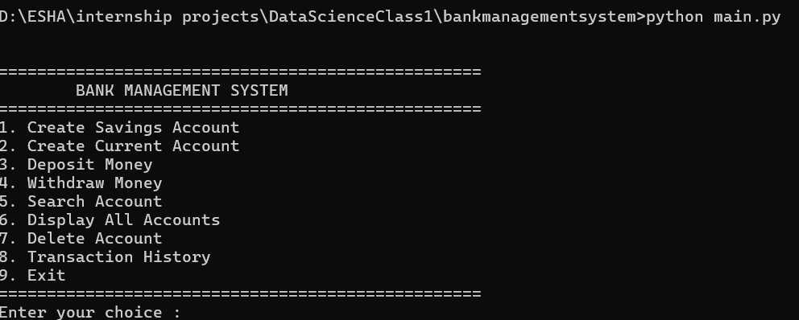
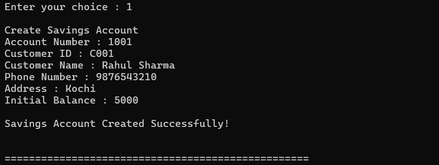
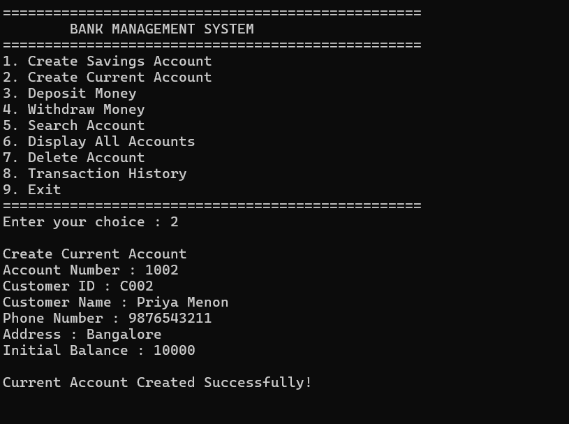
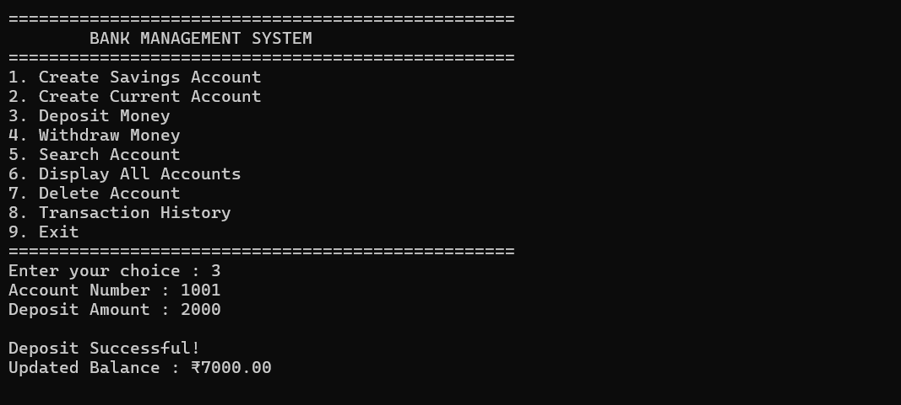
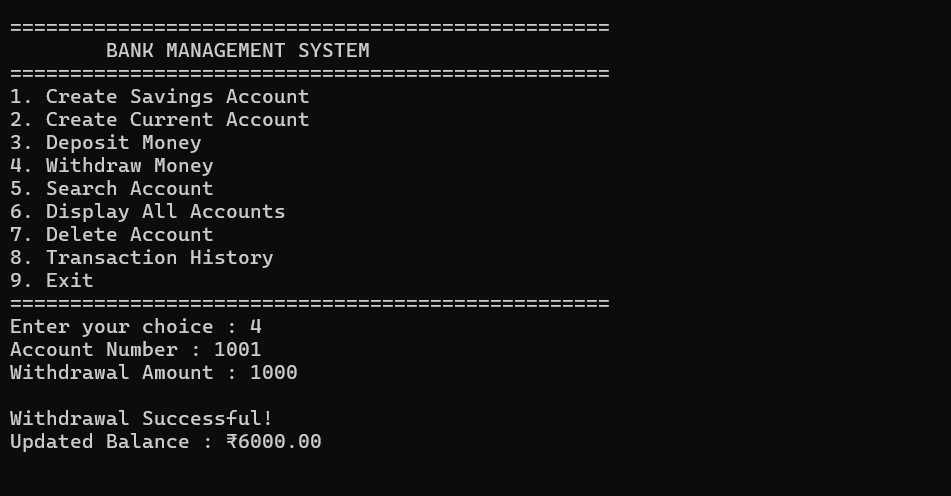
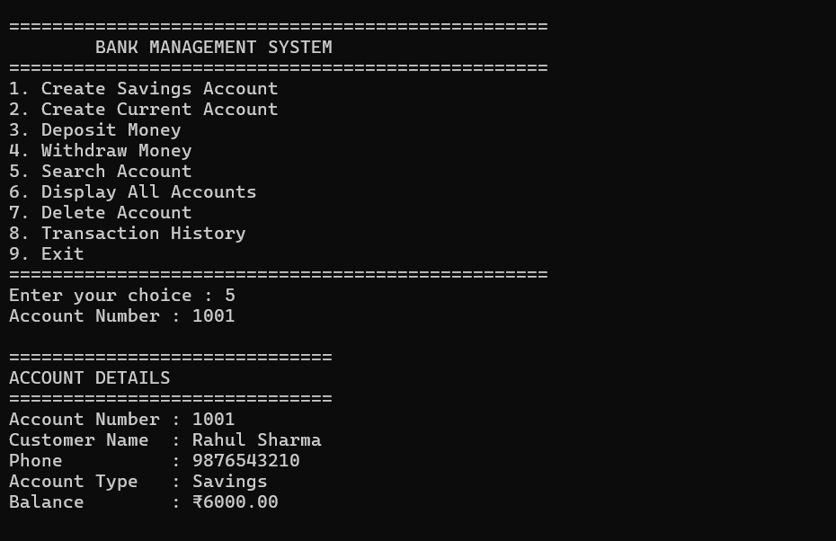
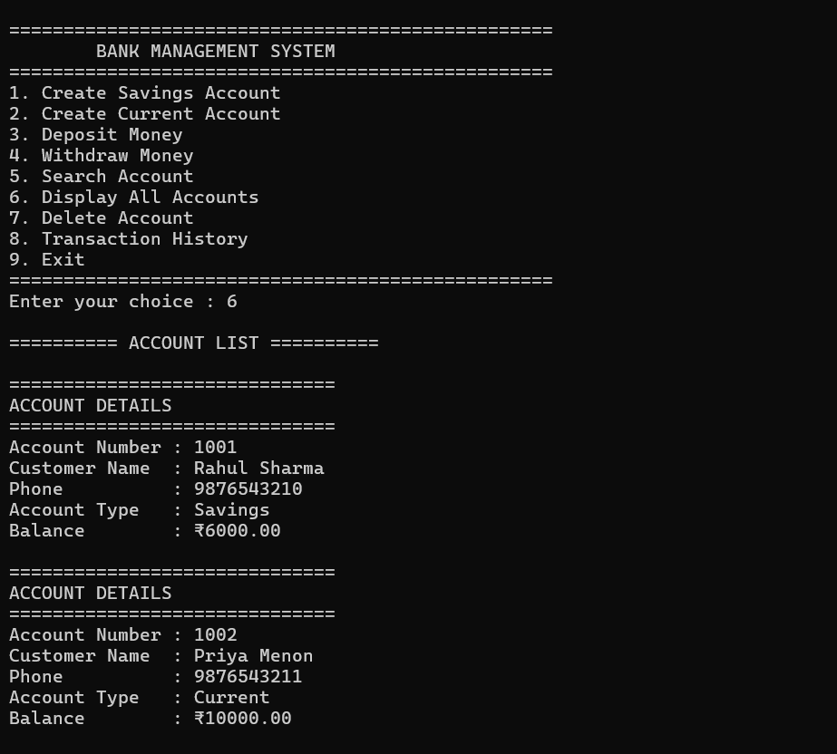
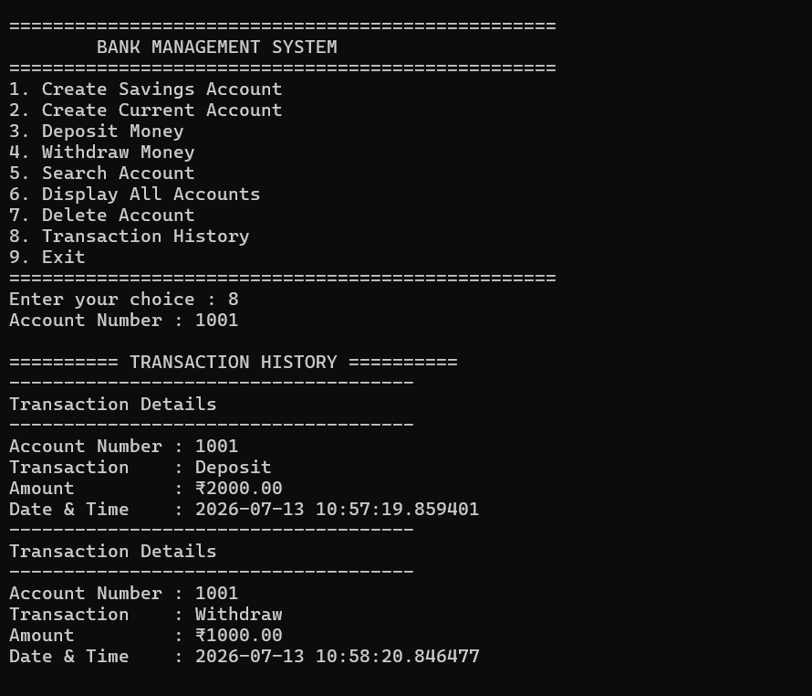
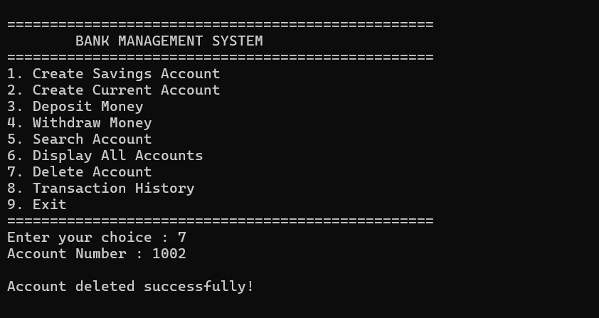
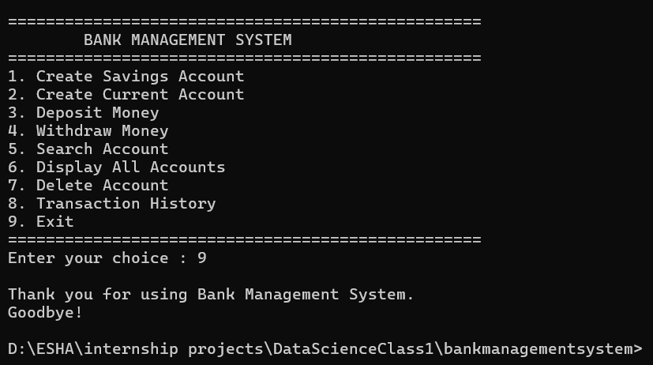

# Bank Management System

## Overview

The Bank Management System is a console-based application developed in Python using Object-Oriented Programming (OOP) principles. The system simulates basic banking operations such as account creation, deposits, withdrawals, account management, and transaction history maintenance. Data persistence is achieved using CSV files, allowing account information and transaction records to be stored between program executions.

---

## Features

- Create Savings Account
- Create Current Account
- Deposit Money
- Withdraw Money
- Search Account
- Display Individual Account Details
- Display All Accounts
- Delete Account
- View Transaction History
- Persistent data storage using CSV files
- Input validation and exception handling

---

## Object-Oriented Programming Concepts Implemented

This project demonstrates the following OOP concepts:

- Classes and Objects
- Encapsulation
- Inheritance
- Abstraction
- Polymorphism
- Composition

---

## Project Structure

```
BankManagementSystem/
│
├── account.py
├── bank.py
├── current_account.py
├── customer.py
├── file_manager.py
├── main.py
├── savings_account.py
├── transaction.py
│
├── data/
│   ├── accounts.csv
│   └── transactions.csv
│
├── README.md
├── LICENSE
└── .gitignore
```

---

## Class Description

### Account
An abstract base class representing a generic bank account. It provides common functionalities such as deposits, balance management, and account display.

### SavingsAccount
Derived from the `Account` class. Implements withdrawal rules while maintaining a minimum account balance.

### CurrentAccount
Derived from the `Account` class. Implements withdrawal functionality without minimum balance restrictions.

### Customer
Stores customer-related information including customer ID, name, phone number, and address.

### Transaction
Represents individual banking transactions, including deposits and withdrawals, along with the transaction timestamp.

### FileManager
Handles reading from and writing to CSV files for persistent storage of account and transaction data.

### Bank
Acts as the central controller of the application by coordinating all banking operations such as account creation, deposits, withdrawals, searching, deletion, and transaction management.

---

## Data Storage

The application stores information using CSV files located in the `data` directory.

### accounts.csv

Stores:

- Account Number
- Customer ID
- Customer Name
- Phone Number
- Address
- Account Type
- Balance

### transactions.csv

Stores:

- Account Number
- Transaction Type
- Transaction Amount
- Date and Time

---

## Software Requirements

- Python 3.10 or higher
- No external Python libraries are required.

---

## Installation

Clone the repository:

```bash
git clone https://github.com/Eshaap0806/DataScienceClass1.git
```

Navigate to the project directory:

```bash
cd DataScienceClass1/BankManagementSystem
```

Run the application:

```bash
python main.py
```

---

## Sample Menu

```
==================================================
            BANK MANAGEMENT SYSTEM
==================================================

1. Create Savings Account
2. Create Current Account
3. Deposit Money
4. Withdraw Money
5. Search Account
6. Display All Accounts
7. Delete Account
8. Transaction History
9. Exit
```

---

## Sample Test Cases

| Test Case | Expected Result |
|------------|-----------------|
| Create Savings Account | Account created successfully |
| Create Current Account | Account created successfully |
| Deposit Money | Balance updated successfully |
| Withdraw Money | Balance updated successfully |
| Search Account | Account details displayed |
| Display All Accounts | All accounts displayed |
| Delete Account | Account removed successfully |
| Transaction History | Transaction records displayed |
| Invalid Deposit Amount | Appropriate error message |
| Invalid Withdrawal Amount | Appropriate error message |
| Invalid Account Number | Account not found message |

---

## Exception Handling

The application includes exception handling for:

- Invalid numeric inputs
- Invalid menu selections
- Negative deposit amounts
- Insufficient account balance
- Minimum balance violations
- Duplicate account numbers
- Invalid account searches
- File handling errors

---

## Future Enhancements

Possible future improvements include:

- Graphical User Interface (GUI)
- SQLite or MySQL database integration
- User authentication and login system
- Interest calculation for savings accounts
- Fund transfer between accounts
- Password-protected customer accounts
- Administrative dashboard
- Account statement generation in PDF format

---

## Author

**Esha A P**

Bachelor of Technology (Computer Science and Engineering)

---

## License

This project is licensed under the MIT License.

## Program screenshots
### main menu

### savings account

### current account

### deposit money

### withdraw money

### search account

### display accounts

### transaction history

### delete account

### exit



